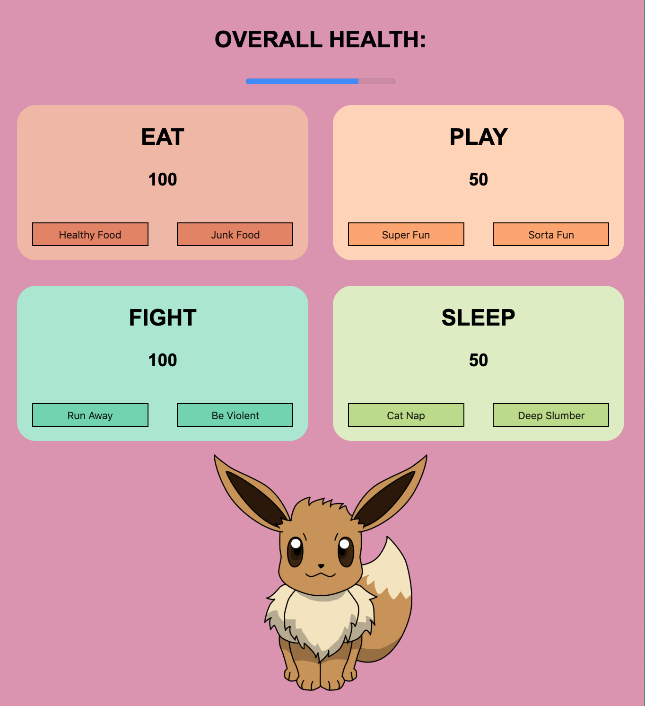

# NSS Exercise: "Tamagotchi”

### Technologies Used:
HTML5, SCSS, Vanilla Javascript

### Description:
NSS homework project, which introduces Sass styling.

Use hard-coded HTML, SCSS styles, and Javascript to design a single-page app that simplifies the idea of the Tamagotchi toy that was popular in the 1990's.

#### Exercise Requirements
- Must use modules that are laced together with webpack
- Must use eslint and babel
- CANNOT use Bootstrap for styling (all styling must be done in .scss files)
- HTML code is provided cannot be changed
- Specific requirements for each "quad" section of the site (certain activities impact a score in a specific manner)
- [Homework Readme Here](https://github.com/nss-nightclass-projects/exercise-vault/blob/master/MODULES_tamagotchi.md)

#### Bonus Challenges Completed
- [x] Overall Progress Bar (average of four health scores)
- [x] Pet Picture (allow user to input URL for photo)

### Screenshot:
#### Main view, with pet photo added

### Instructions to Run:
1. If you do not have npm http-server installed, follow instuctions [here](https://www.npmjs.com/package/http-server) to install on your device
1. Use GitHub's [Cloning Feature](https://help.github.com/en/github/creating-cloning-and-archiving-repositories/cloning-a-repository) to download a local copy of the files for this project
1. In your command line interface, change directory into the folder that contains your copied files
1. Enter command: `http-server -p 8080` or `hs -p 8080`
1. The project will now render in your browser at url: `http://localhost:8080`
